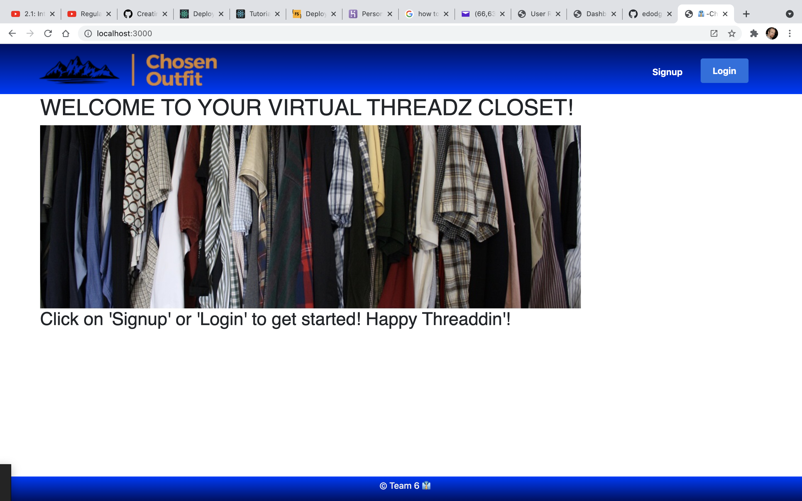
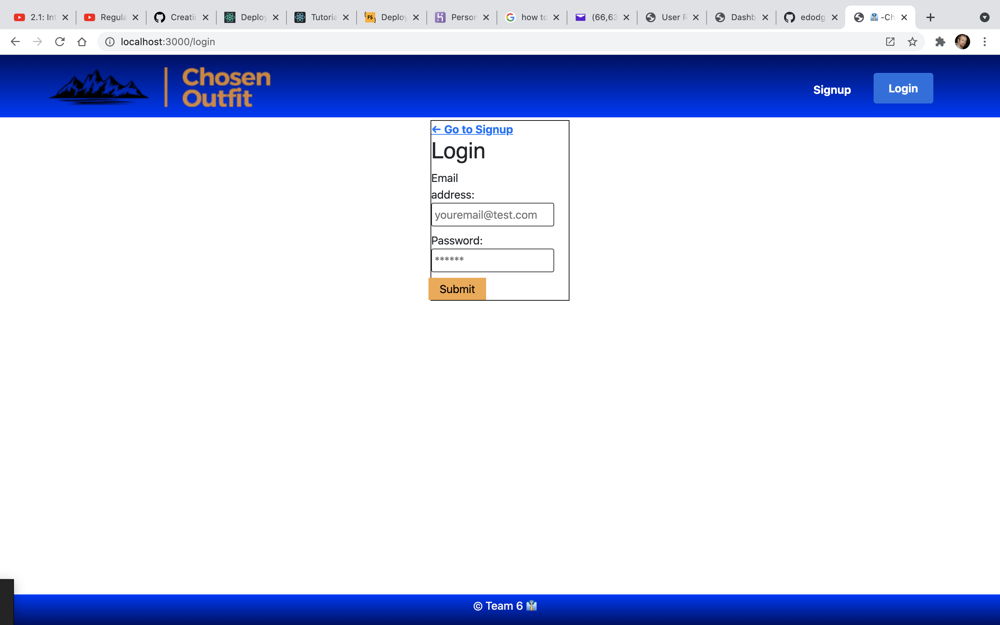
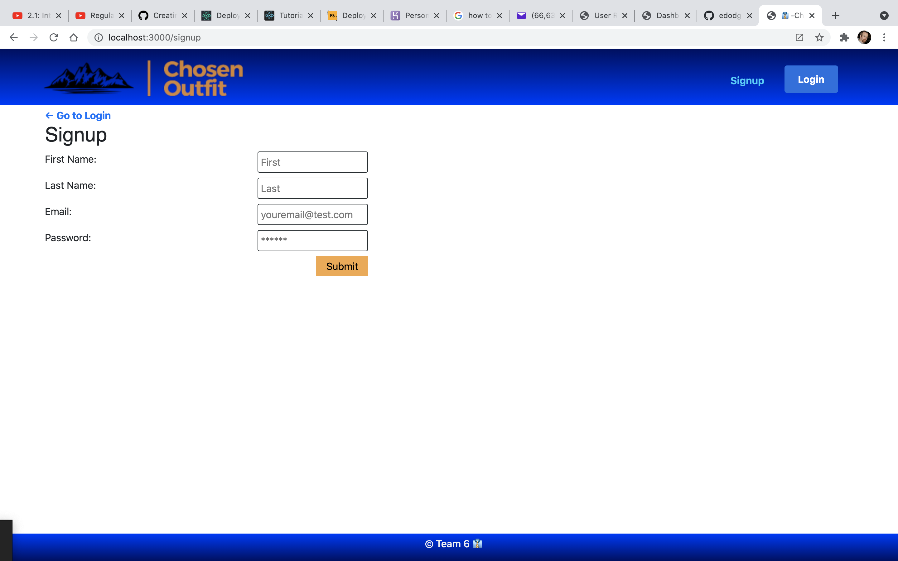
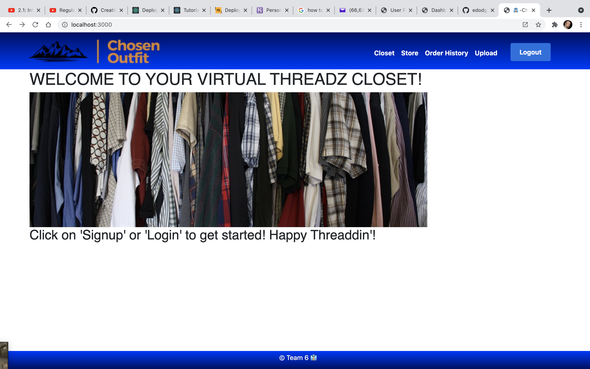
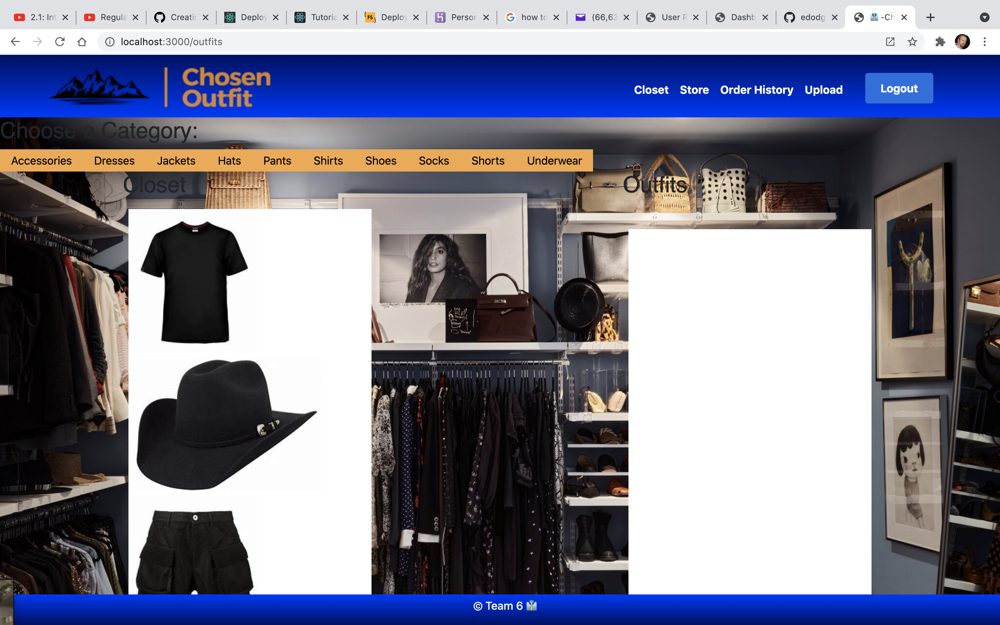
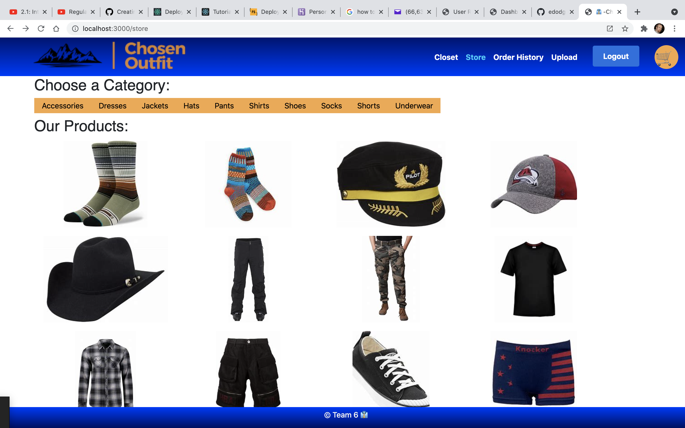
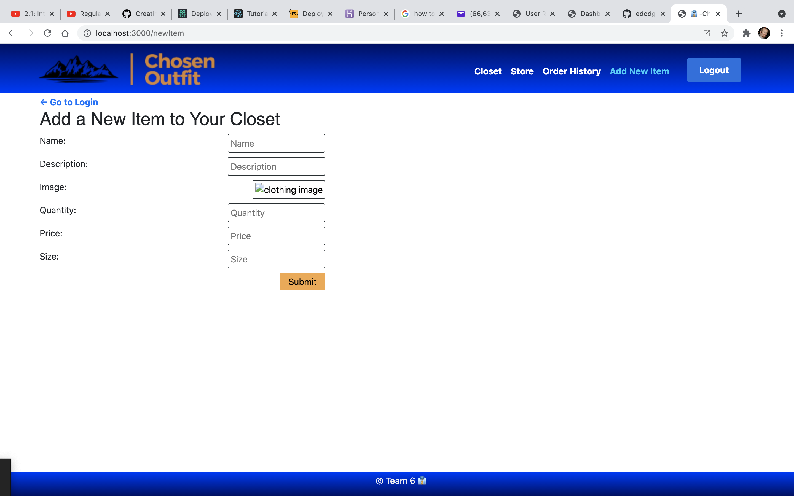

# Project-3 - The Chosen Outfit App

## Introduction

Welcome to the last clothing organization app you'll ever need!  This interactive app is a virtual closet where users have complete control over the clothes that they own.  While using this app, a user can view, manage, organize, and even sell their items of clothing!  

The deployed app can be viewed here: 
[Chosen Outfit App] (https://chosen-outfit.herokuapp.com/)

# How it Works

When you visit the app, if it is your first time utilizing it, you can click the 'sign-up' button and create a free account.  The sign-up page will be where you can enter your first and last name, your e-mail, and a unique password. (Note: this password is NOT the same as the password you use to access your e-mail.  For the sake of security, we recommend you create a password that is unique to the app.) 

 

 

# Navigating the App

Once the user has either signed in or created an account, you will still be on the same page; however, near the top of the screen, there are more options than 'sign-up' or 'log-in.'  You will now see the words 'closet', 'store', 'order history', 'upload' and 'logout'.  Clicking on 'logout' will return you to the previous page.  You can click on the following links to view where these options will take you in the app.

* closet
* store
* order history
* upload

# Closet

If you click on 'closet' from the logged-in screen, you will navigate to a page that presents the user with three options.  They can view their closet, create an outfit, or go to the store to potentially purchase or sell items of clothing.

Creating an outfit is one of the best features of using this app.  Incorporating a drag-and-drop system, the user can easily rifle through their clothing options and compile an outfit for the day!  

View your closet - as the title suggests, clicking this button will allow you to view the items in your virtual closet!  You can peruse all of your clothes at once, or narrow your search down by selecting a category, such as shirts, pants, shoes, etc.

Go to store - This button will redirect you to our store page.  This is a virtual online marketplace for selling and buying clothing.  Each image of clothing comes with built-in information about that item, such as size, description, and price. Keep reading to find out how to view that information.

# Store

Selecting the store will take you straight to the online market from the logged-in page.  Here you can purchase or sell articles of clothing.  Each image of clothing is attached to a card.  When the mouse hovers over the image, the picture will flip like a card.  The other side of that image will tell you the price of that item, and gives you the option to purchase.

# Order History

From the 'Order History' link in the logged-in page, you can view a detailed history of the items you have either purchased or sold.  This is a great way to keep track of your activity and manage your clothing.  For example, if you can't find your favorite hat, perhaps you sold it and don't remember.  Or if you found some pants in your drawer that you're sure don't belong to you, you can view your history and see that you did, in fact, purchase them.

# Add New Item

Let's say you aquired some new clothes, and you want to add them to your closet!  Using this app makes it quick and simple.  All the user has to do is lay out their new clothing flatly in a well-lit area before using their smartphone to snap a picture of it.

Once a picture has been taken, the user can upload the image to their computer, or upload it directly to our app from their smartphone. They will be prompted to enter the name of the item, a brief description, the quantity of the item, the price if the user is selling the item, and the size of the item.  

If you have any questions regarding this app, please reach out to one of the contributors listed below for assistance.  All contributors have accounts on GitHub.

Contributors:

Eric Dodgion
Cody Gallagher
Evan Mora
Kevin Hanson
Jonathan Davidson